# Used Market — 중고 거래 플랫폼

---

## 1. 개요

개인 셀러가 중고 의류·잡화를 등록하고, 구매자가 즉시 구매하거나 **채팅으로 가격을 협상**해 거래하는
한국형 중고 거래 플랫폼이다. Spring Boot 백엔드와 React SPA로 구성되며, 두 축의 기술적 초점은 다음과 같다.

- **거래 도메인의 정확성** — 주문 상태 전이 가드, 비관적 락 기반 이중 판매 방지, 만료 예약 자동 취소
- **의미 기반 상품 검색** — pgvector + Gemini 임베딩으로 자연어 질의를 처리하고, 임베딩 생성은 비동기 파이프라인으로 분리
- **인증** — JWT Access/Refresh + Spring Security, Refresh Token 회전과 재사용 탐지
- **운영 기반** — GitHub Actions CI(Testcontainers), 멀티 스테이지 Docker 이미지, 단일 서버 Compose 배포

### 기술 스택

| 구분 | 기술 |
|---|---|
| 언어 · 빌드 | Java 17, Gradle 9.4.1 |
| 프레임워크 | Spring Boot 4.0.6 (Web MVC, Data JPA, Security, Batch, WebSocket, AOP, Validation) |
| ORM · 검색 | Hibernate ORM 7.2.12 + `hibernate-vector`, QueryDSL 5.1.0 (동적 필터), 네이티브 SQL (벡터 검색) |
| DB | PostgreSQL 16 + `pgvector` 확장, Flyway(확장 생성 전용), p6spy(local/dev SQL 로깅) |
| 인증 | Spring Security, JJWT 0.12.6 (HS256) |
| 임베딩 | Google Gemini `gemini-embedding-001` (768차원), Spring `RestClient` 직접 호출 |
| 실시간 | STOMP over WebSocket (`spring-boot-starter-websocket`) |
| 프론트엔드 | React 18.2, Vite 4.5, React Router 6, `@stomp/stompjs` 7, Tailwind CSS 3.4, Radix UI |
| 테스트 | JUnit 5, `@SpringBootTest`, Testcontainers 1.21.4 (`pgvector/pgvector:pg16`) |
| CI/CD · 배포 | GitHub Actions, GHCR, 멀티 스테이지 Docker(`eclipse-temurin:17`), Docker Compose, Discord 실패 알림 |

### 아키텍처

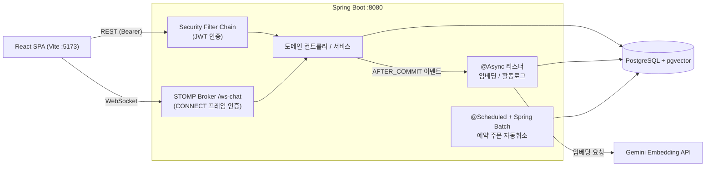
```mermaid
flowchart LR
    B["React SPA (Vite :5173)"]
    subgraph API["Spring Boot :8080"]
      SEC["Security Filter Chain<br/>(JWT 인증)"]
      C["도메인 컨트롤러 / 서비스"]
      STOMP["STOMP Broker /ws-chat<br/>(CONNECT 프레임 인증)"]
      ASYNC["@Async 리스너<br/>임베딩 / 활동로그"]
      BATCH["@Scheduled + Spring Batch<br/>예약 주문 자동취소"]
    end
    PG[("PostgreSQL + pgvector")]
    GEMINI["Gemini Embedding API"]

    B -- "REST (Bearer)" --> SEC --> C --> PG
    B -- "WebSocket" --> STOMP --> C
    C -- "AFTER_COMMIT 이벤트" --> ASYNC
    ASYNC -- "임베딩 요청" --> GEMINI
    ASYNC --> PG
    BATCH --> PG
```

### 로컬 실행

```powershell
# 1) DB (pgvector)
docker compose up -d                 # 호스트 5433 -> 컨테이너 5432

# 2) 백엔드 (:8080)  — 시맨틱 검색을 쓰려면 GEMINI_API_KEY 필요(무료 발급, 없어도 앱은 정상 기동)
$env:GEMINI_API_KEY="..."; .\gradlew.bat bootRun

# 3) 프론트엔드 (:5173, /api·/ws-chat 를 :8080 으로 프록시)
cd frontend; npm install; npm run dev
```

기동 시 `InitDb`(local/dev 프로필)가 회원·상품·주문·채팅·위시리스트의 다양한 상태 조합을 시드한다.
데모 계정: 판매자 `seller1`~`seller4`, 구매자 `buyer1`~`buyer6`, 비밀번호는 모두 `password123!`.

---

## 2. 기능

각 소절은 **문제상황 / 트레이드오프 / 기능 / 구현 / 화면 흐름** 순서다.

---

### 2-1. JWT 기반 인증 & Spring Security 전환

**문제상황**
초기 구현은 `HttpSession` 기반 인증에 비밀번호를 평문으로 저장·비교했다. 세션 고정 공격에 취약하고,
쿠키 보안 속성이 없었으며, 별도 오리진에서 도는 React SPA와 STOMP WebSocket 양쪽에서 일관되게
쓸 인증 모델이 필요했다.

**트레이드오프**

| 선택지 | 채택 | 이유 · 감수한 대가 |
|---|---|---|
| 세션 vs **stateless JWT Access Token** | JWT | 세션 서버가 필요 없고 REST·STOMP에서 동일하게 검증. 대가: **로그아웃해도 이미 발급된 Access Token은 만료(30분)까지 유효** — 즉시 무효화하려면 Redis 기반 `jti` 저장이 필요하나 범위상 의도적으로 수용 |
| Spring Security `AuthenticationManager` 로그인 vs **`LoginService`가 `PasswordEncoder`로 직접 검증** | 직접 검증 | 로그인 흐름을 단순하게 유지. 대신 `UserDetailsService` 빈이 없으면 Boot가 임의 비밀번호로 기본 사용자를 자동 생성하므로, 그것을 막는 더미 빈을 명시적으로 등록 |
| 커스텀 `@Login` + 인터셉터 유지 vs **Spring Security 필터 체인** | Security | 인가 규칙(`permitAll` 목록, `hasRole("ADMIN")`)을 한 곳에서 선언적으로 관리. 대가: 인증 실패 응답이 도메인 예외의 `{error, message}` 포맷이 아닌 Spring 기본 포맷이 됨(문서화된 의도적 차이) |

**기능**
`POST /api/login` → Access Token(응답 바디, 30분) + Refresh Token(`HttpOnly` 쿠키, 14일).
보호 리소스는 `Authorization: Bearer` 헤더로 접근하고, 미인증 시 프론트가 `/auth?next=<원래 경로>`로
보낸 뒤 로그인 성공하면 원래 경로로 복귀한다. 컨트롤러는 `@AuthenticationPrincipal LoginMember`로
로그인 사용자를 주입받는다.

**구현**
- `web/security/SecurityConfig` — `SessionCreationPolicy.STATELESS`, `authorizeHttpRequests`로 `permitAll`/`hasRole` 선언, `addFilterBefore(new JwtAuthenticationFilter(...), UsernamePasswordAuthenticationFilter.class)` (`SecurityConfig.java:41,43,58,61`)
- `web/security/JwtAuthenticationFilter` — `OncePerRequestFilter`. `Bearer` 토큰을 `JwtTokenProvider.parseLoginMember()`로 파싱해 `SecurityContextHolder`에 인증을 채우고, 파싱 실패 시 `clearContext()`로 조용히 통과(이후 인가 단계가 401 처리) (`JwtAuthenticationFilter.java:30,34,36`)
- `web/jwt/JwtTokenProvider` — `Keys.hmacShaKeyFor(secret)`, `signWith(secretKey, Jwts.SIG.HS256)`, 클레임에 `loginId`/`nickname`/`role`. 시크릿이 로컬 기본값이면 부팅 시 `log.warn`
- `web/login/LoginService.authenticate()` — `memberRepository.findByLoginId(...).filter(m -> passwordEncoder.matches(raw, m.getPassword()))`
- `web/config/PasswordEncoderConfig` — `BCryptPasswordEncoder`
- 프론트: `frontend/src/context/SessionContext.jsx`가 마운트 시 silent refresh → `GET /api/members/me`로 세션 복원, `components/RequireAuth.jsx`가 `/auth?next=` 리다이렉트

**화면 흐름**

| 로그인 폼 입력 | 로그인 성공 → 홈 | 로그인 후 보호 페이지 접근 |
|---|---|---|
| 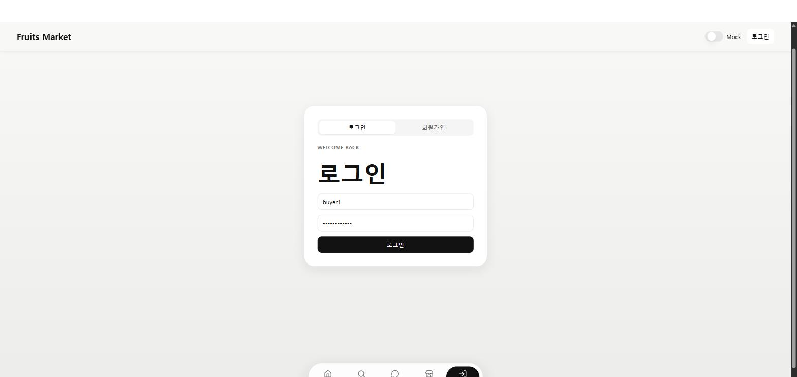 | 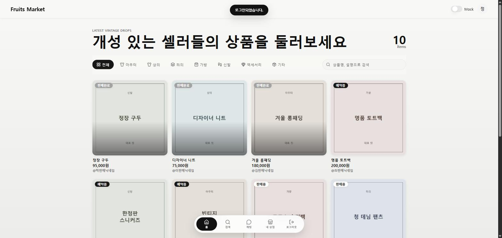 | 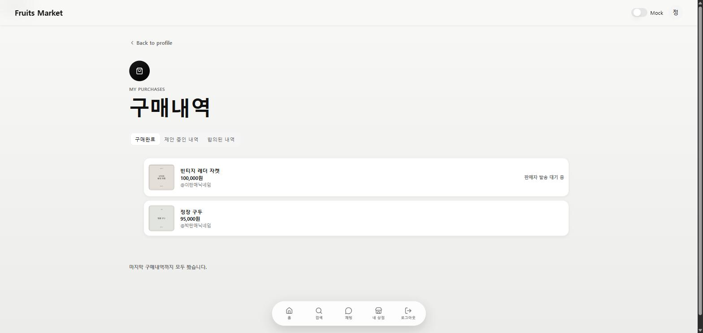 |
| 데모 계정 `buyer1` 입력 | 상단 토스트 "로그인되었습니다." + 우측 아바타, 하단 네비게이션이 "로그아웃"으로 전환 | 미인증 상태에서 `/profile/purchases` 진입 시 `/auth?next=%2Fprofile%2Fpurchases`로 보냈다가, 로그인 후 구매 내역이 정상 노출 |

---

### 2-2. Refresh Token 회전 & 재사용 탐지

**문제상황**
Access Token을 stateless로 두면 탈취 시 만료까지 막을 수 없다. 장기 세션을 담당하는 Refresh Token은
**탈취를 탐지하고 즉시 무효화**할 수 있어야 한다.

**트레이드오프**

| 선택지 | 채택 | 이유 · 대가 |
|---|---|---|
| Refresh Token을 JWT로 vs **opaque 랜덤 + DB 저장** | opaque 랜덤 | `SecureRandom` 32바이트 → Base64URL, DB에는 **SHA-256 해시만** 저장. 서버 상태를 가지지만 그래야 회전·폐기·재사용 탐지가 가능 |
| 재사용 탐지 시 예외를 던지며 트랜잭션 롤백 vs **`noRollbackFor`로 무효화는 커밋** | `noRollbackFor` | 기본 롤백 정책이면 "모든 토큰 무효화" 자체가 롤백되어 방어가 무력화됨 — 구현 중 실제로 겪은 버그 |
| 폐기된 토큰 row 삭제 vs **보존** | 보존 | 재사용 탐지의 근거로 남김. 대가: 별도 정리 배치가 필요(미구현, 남은 과제) |

**기능**
`POST /api/token/refresh`(바디 없음, 쿠키만)를 호출하면 **새 Access + 새 Refresh를 발급하고 기존 Refresh를 폐기**한다(회전).
이미 폐기된 Refresh Token이 다시 제출되면 = 탈취 정황으로 보고, **해당 회원의 모든 Refresh Token을 즉시 무효화**하고 401을 반환한다.

**구현**
- `domain/auth/RefreshTokenService`
  - `issue()` — `SecureRandom` → raw token, `hash(rawToken)`(SHA-256)만 저장 (`RefreshTokenService.java:23,35,80`)
  - `rotate()` — `@Transactional(noRollbackFor = JwtAuthenticationException.class)`. `current.isRevoked()`이면 `revokeAll(memberId)` 후 예외, 정상이면 현재 토큰 `revoke()` 후 재발급 (`RefreshTokenService.java:41,46,48`)
- `domain/auth/RefreshToken` — `token_hash`(64자, unique), `revoked_at` nullable, row는 삭제하지 않음
- `web/jwt/JwtAuthenticationException extends UnauthorizedException` → 인증 계열은 일관되게 401

**동작 근거(실제 DB)**
회원당 회전 체인이 누적된다. 로그인/재발급을 반복한 계정(`members_id=5`)의 `refresh_token` 테이블:

```text
 members_id | total | revoked | active
------------+-------+---------+--------
          5 |    32 |      25 |      7     -- refresh 마다 직전 토큰이 revoked 로 전환됨
```

> 화면 흐름 없음(백엔드 로직). 프론트는 401 응답 시 `api/client.js`가 `token/refresh`로 자동 재발급 후 원 요청을 1회 재시도한다(2-14 참고).

---

### 2-3. pgvector 기반 시맨틱 상품 검색

**문제상황**
기존 `keyword` 검색은 QueryDSL `LIKE '%kw%'`였다. 인덱스를 타지 못했고, 단순 문자열 부분 일치라
"쌀쌀할 때 걸치는 겉옷" 같은 **자연어 의도 검색**이 불가능했다.

**트레이드오프**

| 선택지 | 채택 | 이유 · 대가 |
|---|---|---|
| `LIKE` 유지 vs **벡터 코사인 유사도** | 벡터 | 상품명·설명의 의미로 검색. 대가: 임베딩 인프라(pgvector, 외부 API)가 추가됨 |
| QueryDSL/JPQL vs **네이티브 SQL** | 네이티브 | QueryDSL이 pgvector `<=>` 연산자를 1급 지원하지 않음. 대가: 타입 안정성 상실, 결과를 `Object[]` → DTO로 수동 캐스팅 |
| 3072차원 vs **768차원 축소** | 768 | `items.embedding` 컬럼과 HNSW 인덱스 크기를 작게 유지. 대가: 임베딩 표현력 일부 손실 |
| IVFFlat vs **HNSW 인덱스** | HNSW | 학습(clustering) 단계가 없어 데이터 유무·시딩 시점과 무관하게 부팅 시 `CREATE INDEX IF NOT EXISTS`로 보장 가능 |
| 판매자 닉네임 부분 일치 유지 vs **제거** | 제거 | 검색의 성격이 "상품 의미 검색"으로 바뀌었으므로 의도적으로 제거 |

**기능**
`GET /api/items?keyword=&category=&status=&priceGoe=&priceLoe=&page=&size=` 하나로 두 경로를 분기한다.
`keyword`가 **없으면** QueryDSL 동적 필터 + 최신순, **있으면** pgvector 시맨틱 검색(코사인 거리 오름차순).
두 경로 모두 category/status/price 필터는 정확 매칭으로 결합하고, `limit(size+1)` 트릭으로 count 쿼리 없이 `hasNext`를 계산한다.

**구현**
- `domain/item/repository/ItemRepositoryImpl`
  - `searchItems()` — `hasText(keyword)`로 `searchByVector` / `searchByFilters` 분기 (`:49-53`)
  - `searchByVector()` — `itemEmbeddingService.embed(keyword)` → `float[]` → 벡터 리터럴, `em.createNativeQuery(VECTOR_SEARCH_SQL)` (`:85,91`)
  - `VECTOR_SEARCH_SQL` — `WHERE i.embedding IS NOT NULL`, `CAST(:param AS ...) IS NULL OR ...` 동적 필터, `ORDER BY i.embedding <=> CAST(:queryVector AS vector)` (`:36-40`)
  - `searchByFilters()` — QueryDSL, null-safe `BooleanExpression` 조합, 썸네일 `inner join`
- `domain/item/Item` — `float[] embedding` + `@JdbcTypeCode(SqlTypes.VECTOR)` + `@Array(length = 768)` (`hibernate-vector`)
- `domain/item/embedding/ItemEmbeddingService` — Spring `RestClient`로 Gemini `embedContent` 직접 호출(Spring AI 미사용 — 무료 API 키 기반 공식 스타터가 없어서)
- `src/main/resources/db/migration/V1__enable_pgvector_extension.sql` — `CREATE EXTENSION IF NOT EXISTS vector` (스키마 자체는 `ddl-auto=update`가 관리, Flyway는 확장 생성만)

**화면 흐름**

| 검색어 없음 (최신순) | "쌀쌀할 때 걸쳐 입기 좋은 아우터" | "노트북과 책을 넣어 다니는 가방" |
|---|---|---|
|  | 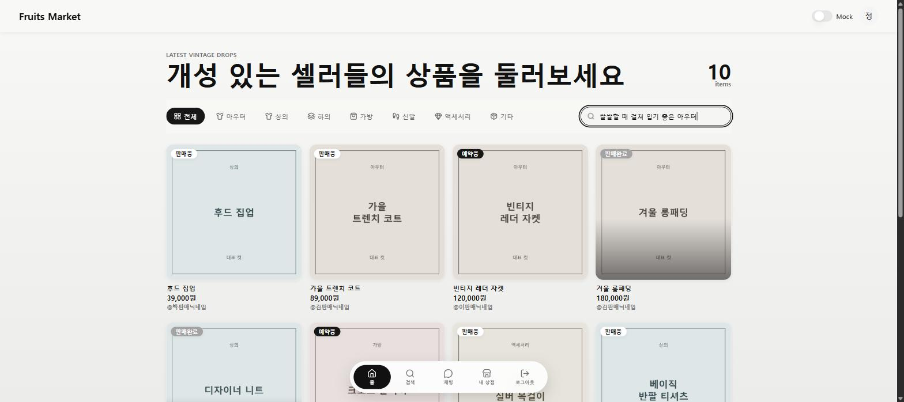 | 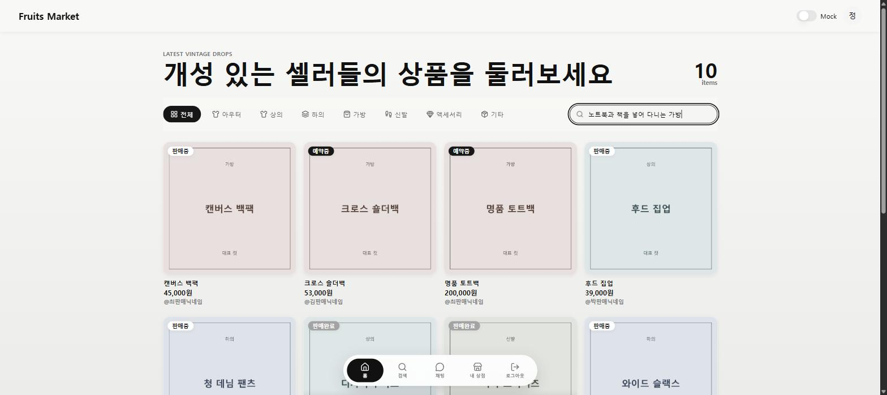 |
| 필터 경로. `item.id DESC` | 질의어("쌀쌀", "걸쳐", "아우터")가 상품명·설명에 **없는데도** 후드 집업·트렌치 코트·레더 자켓·롱패딩이 상위로 정렬 | 마찬가지로 백팩·숄더백·토트백이 상위 3개. 의류·신발은 뒤로 |

---

### 2-4. 임베딩 비동기 파이프라인

**문제상황**
임베딩 생성은 외부 API 호출이라 느리고 실패할 수 있다. 이걸 상품 등록 트랜잭션 안에서 동기로 하면
등록 API가 느려지고, Gemini 장애가 곧 등록 실패가 된다.

**트레이드오프**

| 선택지 | 채택 | 이유 · 대가 |
|---|---|---|
| 동기 임베딩 vs **`@Async` + `@TransactionalEventListener(AFTER_COMMIT)`** | 비동기 | 등록 API가 즉시 응답하고 실패가 격리됨. 대가: **등록 직후 아주 짧은 시간(측정상 1초 미만) 시맨틱 검색 결과에서 누락** (`WHERE embedding IS NOT NULL`) |
| 이벤트 유실 방치 vs **10분 backfill 스케줄러** | backfill | 앱 재시작·이벤트 유실 대비 안전망. `embedding IS NULL`인 상품을 주기적으로 재발행 |
| 매번 재임베딩 vs **`embeddingSourceHash` 캐시** | 해시 캐시 | `name + description`의 해시가 같으면 Gemini 호출을 건너뜀. 수정 시에도 이름/설명이 안 바뀌면 재임베딩 안 함 |
| 리스너에서 바로 DB 쓰기 vs **트랜잭션 경계를 별도 빈으로 분리** | 분리 | 리스너의 self-invocation은 `@Transactional` 프록시를 우회하므로 `ItemEmbeddingWriter`를 별도 빈으로 |

**기능**
상품 등록/수정 → 응답 즉시 반환. 커밋 후 별도 스레드 풀에서 임베딩을 생성해 `UPDATE`.
이벤트가 유실돼도 10분마다 도는 backfill이 채운다.

**구현**
- `ItemService.save()` — `itemRepository.save(item)` 후 `eventPublisher.publishEvent(new ItemEmbeddingRequestedEvent(id))`, `update()`는 이름/설명이 바뀐 경우에만 발행
- `domain/item/embedding/ItemEmbeddingEventListener` — `@Async("itemEmbeddingExecutor")` + `@TransactionalEventListener(phase = AFTER_COMMIT)`, 예외는 `log.warn`으로 삼킴
- `ItemEmbeddingWriter` — 별도 `@Transactional` 빈. 해시 비교 후 `itemEmbeddingService.embed()` → `itemRepository.updateEmbedding(id, embedding, hash)`
- `ItemEmbeddingBackfillScheduler` — `@Scheduled(cron = "0 */10 * * * *")` → `findIdsWithoutEmbedding()` 재발행
- `ItemEmbeddingIndexInitializer` — `ApplicationRunner`, `CREATE INDEX IF NOT EXISTS items_embedding_hnsw_idx ... USING hnsw (embedding vector_cosine_ops)`
- `web/config/AsyncConfig` — `itemEmbeddingExecutor`를 활동 로그용 풀과 분리(네트워크 지연·실패 가능성이 커서 격리)

**동작 근거(실제 관측)**
- 신규 상품 `POST /api/items` 응답: **약 344ms** (Gemini 호출을 기다리지 않음)
- 등록 후 시맨틱 검색에 노출되기까지: **1초 미만** (`AFTER_COMMIT` 비동기 리스너가 임베딩 완료)
- 부팅 로그: `19:51:30 ItemEmbeddingIndexInitializer` (HNSW 인덱스 보장), 시드 상품은 `InitDb`가 이벤트 경로를 타지 않으므로 임베딩이 비어 있었고 → `20:00:00 ItemEmbeddingBackfillScheduler : 임베딩이 없는 상품 15건을 재발행합니다.` 로 채워짐

**화면 흐름**

| 상품 등록 폼 | 등록 직후 시맨틱 검색 노출 |
|---|---|
| 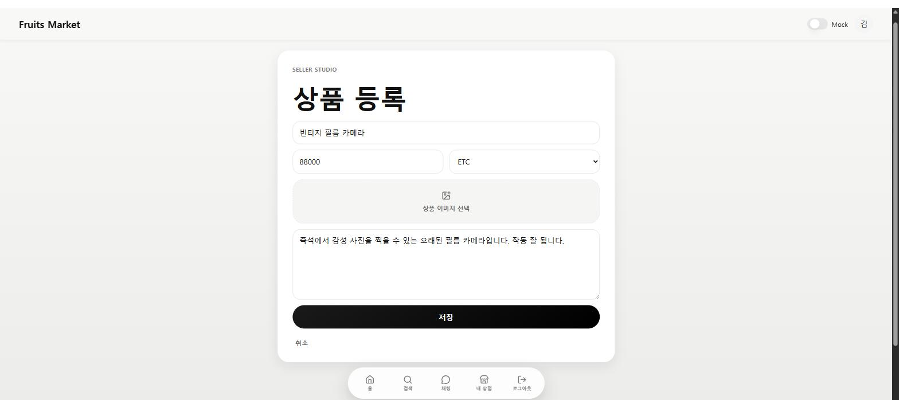 | 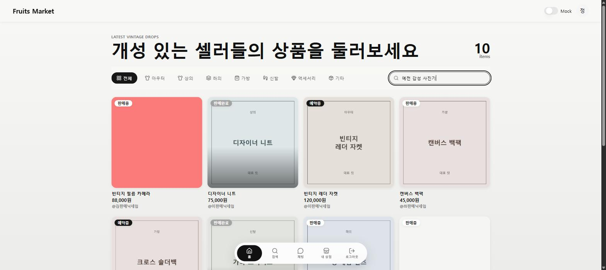 |
| "빈티지 필름 카메라" 등록 (응답 즉시) | 몇 초 뒤 "예전 감성 사진기"로 검색하면 방금 등록한 상품이 1위 — 임베딩이 비동기로 이미 생성됨 |

---

### 2-5. 주문 상태 머신 (도메인 캡슐화)

**문제상황**
주문은 `REQUESTED → RESERVED → PAY_COMPLETED → SHIPPING → COMPLETED`(+ `REJECTED`/`CANCELED`)로 전이한다.
역행·스킵·권한 위반(구매자가 발송 처리 등)이 절대 일어나면 안 되고, 이 규칙이 즉시구매·채팅 수락·PATCH
등 여러 진입점에서 동일하게 강제돼야 한다.

**트레이드오프**

| 선택지 | 채택 | 이유 · 대가 |
|---|---|---|
| 서비스에 `if` 분기 vs **엔티티 도메인 메서드에 가드 캡슐화** | 엔티티 | `accept/pay/ship/confirm/cancel`이 각자 `requireStatus()` + `requireSeller()/requireBuyer()`를 강제. 서비스는 `switch(action)`으로 라우팅만 담당 → 진입점이 늘어도 규칙은 한 곳 |
| 협상가로 `Item.price` 덮어쓰기 vs **`Orders.agreedPrice` 별도 필드** | 별도 필드 | 상품 원가 이력을 보존. 즉시구매도 `agreedPrice = item.price`로 채워 두 경로가 같은 필드를 공유 |

**기능**
`PATCH /api/orders/{orderId}` `{action: ACCEPT|PAY|SHIP|CONFIRM|CANCEL}`. 판매자는 승인/발송/(귀책)취소,
구매자는 결제/구매확정/취소를 요청한다. `CONFIRM` 시 상품 `RESERVED → SOLD`, `CANCEL` 시 `→ SELLING`.
모든 전이마다 `OrdersHistory`(내부 감사 로그)에 스냅샷을 append 한다.

**구현**
- `domain/orders/Orders`
  - `accept()` `requireStatus(REQUESTED)` + `requireSeller` (`:70-72`), `pay()` `requireStatus(RESERVED)` + `requireBuyer` (`:82-84`), `ship()` `requireStatus(PAY_COMPLETED)` + `requireSeller` (`:88-90`), `confirm()` `requireStatus(SHIPPING)` + `requireBuyer` (`:94-96`)
  - `cancel()` — 완료/취소 상태면 `CONFLICT_STATE`, `PAY_COMPLETED`/`SHIPPING`이면 판매자만 (`:101,106`)
  - `requireStatus/requireSeller/requireBuyer` → `OrdersException(CONFLICT_STATE / FORBIDDEN)` (`:112,118,124`)
- `domain/orders/OrdersService.changeOrderStatus()` — 권한(`isBuyer || isSeller`) 확인 후 `switch(action)`, 매 전이마다 `ordersHistoryService.save(orders)`
- `domain/orders/repository/OrdersRepositoryImpl` — 구매/판매 내역은 QueryDSL 생성자 프로젝션으로 N+1 없이 조회

**화면 흐름**

| 판매자 · 판매내역 | 판매자 · 발송 처리 후 | 구매자 · 구매확정 후 |
|---|---|---|
| 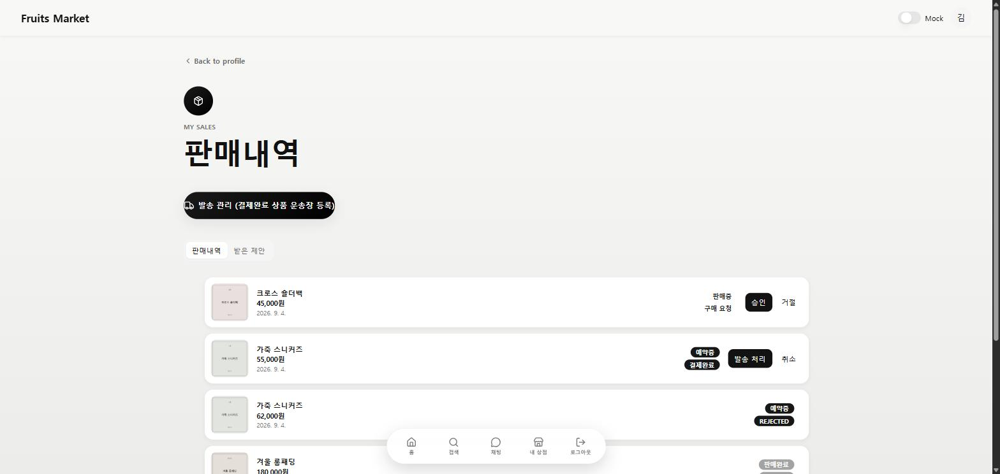 | 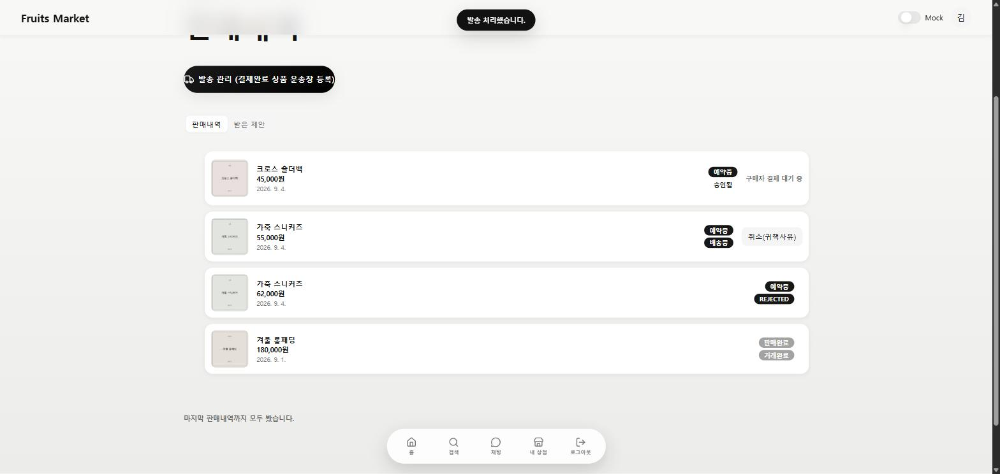 | 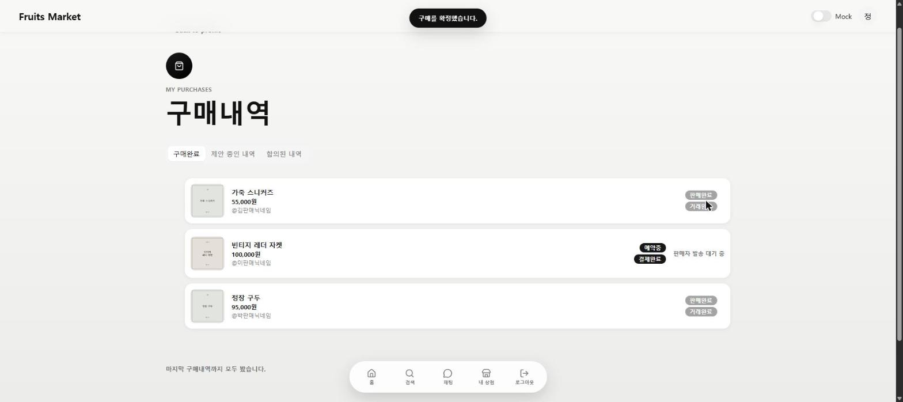 |
| `구매 요청` 주문에는 **승인/거절**, `결제완료` 주문에는 **발송 처리/취소** 버튼. 상태에 따라 가능한 액션만 노출 | 발송 처리 → 배지가 `결제완료` → `배송중`, 버튼은 "취소(귀책사유)"만 남음 (토스트 "발송 처리했습니다.") | 구매자가 구매확정 → 주문 `배송중` → `거래완료`, 상품 배지 `판매완료` |

---

### 2-6. 이중 판매 방지 — 비관적 락

**문제상황**
두 구매자가 같은 상품을 동시에 즉시 구매하거나, 판매자가 두 제안을 거의 동시에 수락하면 **이중 판매**가
발생할 수 있다.

**트레이드오프**

| 선택지 | 채택 | 이유 · 대가 |
|---|---|---|
| 낙관적 락(`@Version`) vs **비관적 락(`SELECT ... FOR UPDATE`)** | 비관적 | 충돌 시 재시도 로직 없이 두 번째 트랜잭션을 즉시 거부. 대가: 락 경합 구간에서 짧게 대기 → `jakarta.persistence.lock.timeout=3000`으로 무한 대기 대신 빠른 실패 |
| 락 실패를 500으로 vs **409로 매핑** | 409 | `GlobalExceptionHandler`가 `PessimisticLockingFailureException`을 409로 변환 |
| 즉시구매·수락에만 락 vs 전 경로에 락 | 두 경로만 | 조회·일반 수정에는 불필요한 락을 걸지 않음 (알려진 한계: `ItemService.update`의 PATCH 경로는 락 없이 상태를 바꿀 수 있어 뒷문이 존재 — 남은 과제) |

**기능**
즉시 구매·채팅 제안 수락 시 상품 행을 `FOR UPDATE`로 잠근 뒤 상태를 검사·전이한다.
같은 상품에 대한 두 번째 시도는 상태 검사에서 걸러지거나(선행 트랜잭션이 이미 커밋) 락 타임아웃으로 실패한다.

**구현**
- `domain/item/repository/ItemRepository.findByIdWithMemberForUpdate()`
  ```java
  @Lock(LockModeType.PESSIMISTIC_WRITE)
  @QueryHints(@QueryHint(name = "jakarta.persistence.lock.timeout", value = "3000"))
  @Query("select i from Item i join fetch i.seller where i.id = :id")
  Optional<Item> findByIdWithMemberForUpdate(@Param("id") Long id);
  ```
- 사용처: `OrdersService.save()`(즉시구매), `OrdersService.acceptNegotiation()`(제안 수락) — 정확히 이 두 곳
- `web/exception/GlobalExceptionHandler` — `@ExceptionHandler(PessimisticLockingFailureException.class)` → `409 conflict_state` (`GlobalExceptionHandler.java:20-24`)
- DB 레벨 2차 방어선: `ChatRoom (item_id, buyer_id)` unique, `WishList (members_id, item_id)` unique

**동작 근거(실제 관측)**
동일 상품에 두 구매자가 동시에 `POST /api/orders/{id}`:

```json
// buyer5
{ "status": 200, "body": { "message": "구매가 완료되었습니다.", "status": "ok" } }
// buyer4 (동시)
{ "status": 409, "body": { "error": "conflict_state", "message": "구매할 수 없는 상품입니다" } }
```

**화면 흐름**

| 사전 가드(이미 예약된 상품) | 동시 구매 성공 (200) | 동시 구매 실패 (409) |
|---|---|---|
| 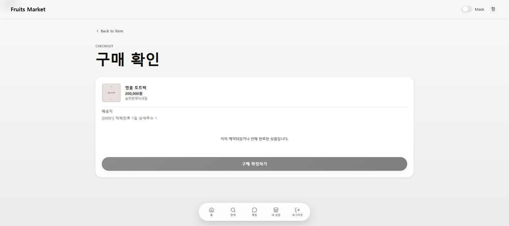 | 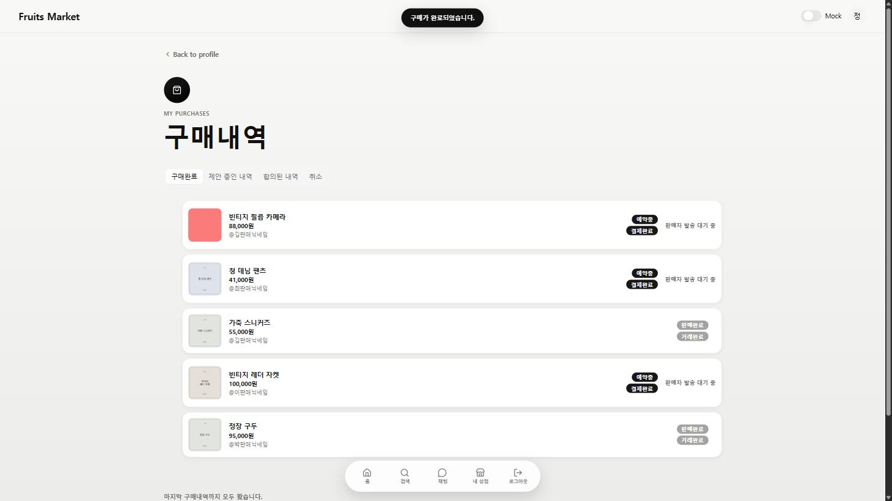 | 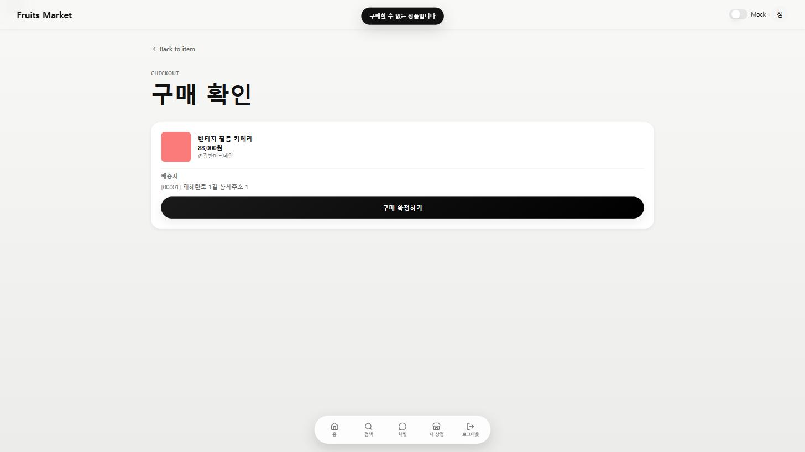 |
| `예약중` 상품의 즉시구매 확인 화면 — "이미 예약되었거나 판매 완료된 상품입니다." 안내와 함께 결제 버튼이 비활성화 | 두 브라우저 세션이 같은 `SELLING` 상품의 결제 확인 화면을 미리 열어둔 채 먼저 "구매 확정하기"를 누른 쪽 — 토스트 "구매가 완료되었습니다." | 곧이어 같은 상품에 결제를 시도한 다른 세션 — 서버가 이미 `RESERVED`로 바뀐 걸 감지해 409를 반환, 토스트 "구매할 수 없는 상품입니다" |

---

### 2-7. 예약 주문 자동 취소 — Spring Batch

**문제상황**
제안 수락으로 `RESERVED`가 된 주문을 구매자가 결제하지 않고 방치하면, 상품이 영구히 묶여 다른 거래를
막는다. 일정 기간이 지난 예약은 자동으로 풀어야 한다.

**트레이드오프**

| 선택지 | 채택 | 이유 · 대가 |
|---|---|---|
| `@Scheduled` 메서드에서 직접 처리 vs **Spring Batch Job(`JobOperator` 트리거)** | Batch | 이미 배치 스타터를 보유. 실행 이력(`batch_job_execution`)이 남아 관측 가능. 대가: 메타 테이블·설정이 늘어남 |
| 부팅 시 Job 자동 실행 vs **끄고 스케줄러만 트리거** | 끔 | `spring.batch.job.enabled=false` — 매시 정각 스케줄러만 실행. 안 끄면 부팅마다 즉시 1회 실행됨 |
| 분산 락 도입 vs **단일 인스턴스 전제** | 단일 인스턴스 | 범위상 스케줄러 분산 락은 두지 않음 — 알려진 제약으로 명시 |

**기능**
매시 정각, `RESERVED` 상태로 `orders.auto-cancel.days`(기본 2일)를 초과해 방치된 주문을 `CANCELED`로
전이하고 상품을 `SELLING`으로 되돌린다.

**구현**
- `domain/orders/batch/OrdersAutoCancelScheduler` — `@Scheduled(cron = "0 0 * * * *")` → `jobOperator.start(job, params)` (매 실행 파라미터가 달라 재실행 가능)
- `OrdersAutoCancelTasklet` — `implements Tasklet`. `LocalDateTime.now(Asia/Seoul).minusDays(autoCancelDays)` 기준으로 `findExpireReservedOrders(RESERVED, expiredDate)` → 각 `orders.cancelExpireReservation()` (더티 체킹으로 flush), `RepeatStatus.FINISHED` (`OrdersAutoCancelTasklet.java:34,36,39,48`)
- `OrdersAutoCancelConfig` — `StepBuilder(...).tasklet(...)`, `JobBuilder(...).start(step)`
- `application.properties` — `spring.batch.jdbc.initialize-schema=always`(TCP PostgreSQL은 embedded로 인식 안 돼 기본값으론 메타 스키마가 안 생김), `spring.batch.job.enabled=false`

**동작 근거(실제 관측)**
`findExpireReservedOrders`는 `created_date`가 아니라 **`last_modified_date`** 기준으로 만료를 판단한다
(제안 수락으로 `RESERVED`가 된 시점 = 마지막 수정 시점). `last_modified_date`가 3일 전인 예약 주문이
정각 배치에서 취소되고 상품이 판매중으로 복귀했다.

```text
-- orders
 orders_id | order_status |        last_modified_date
-----------+--------------+-----------------------------
        15 | CANCELED     | 2026-09-05 04:00:00.150301   -- 정각(분 단위 테스트 트리거)에 자동 취소

-- 취소 전/후 item 17 상태
RESERVED → SELLING
```

**화면 흐름**

| | 배치 실행 전 | 배치 실행 후 |
|---|---|---|
| **상품 상세** | 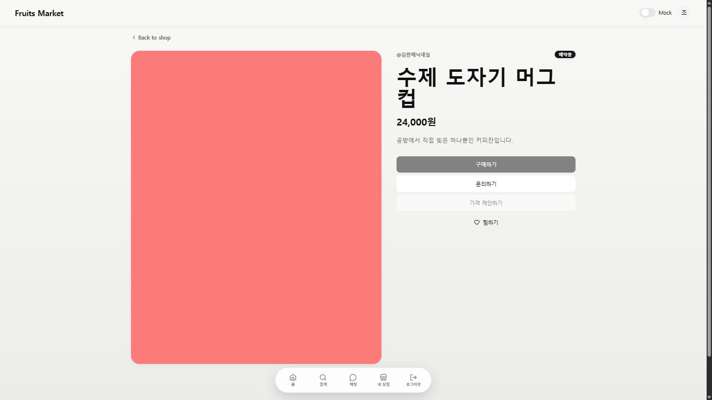 | 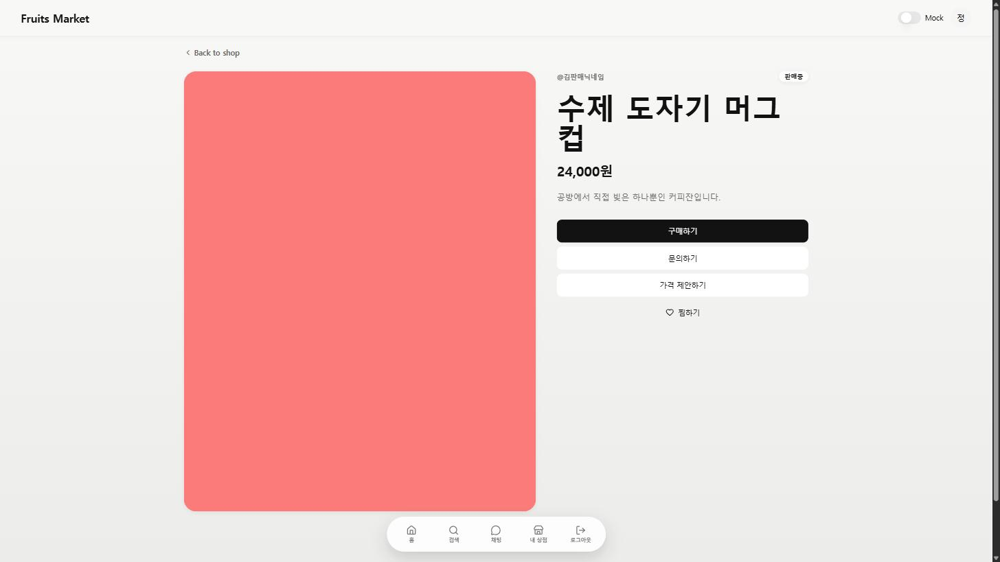 |
| | `예약중` 배지 + "구매하기"/"가격 제안하기" 버튼이 딤드 처리되어 클릭 불가 | 배지가 다시 `판매중`으로, 버튼도 다시 활성화 |
| **구매자 화면** | 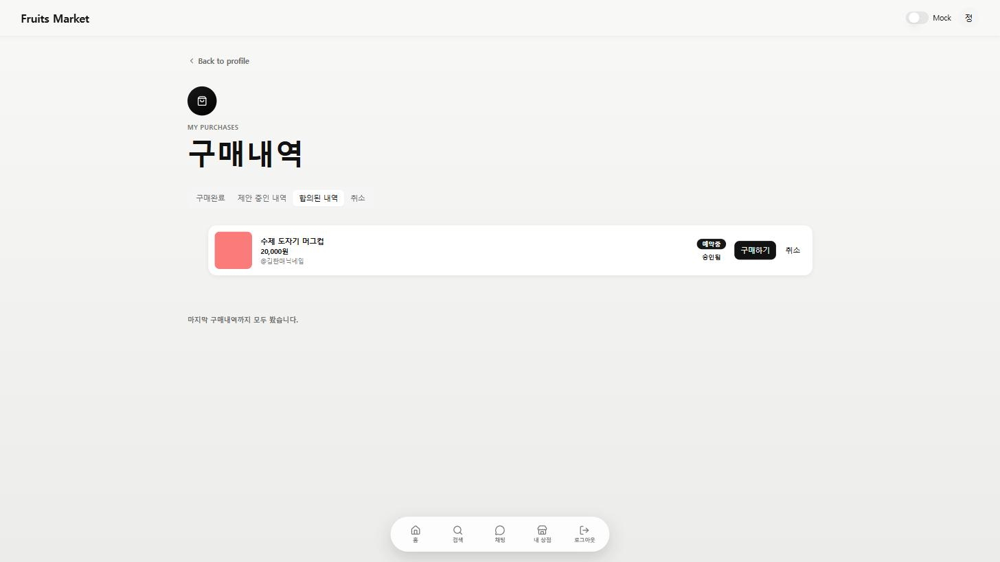 | 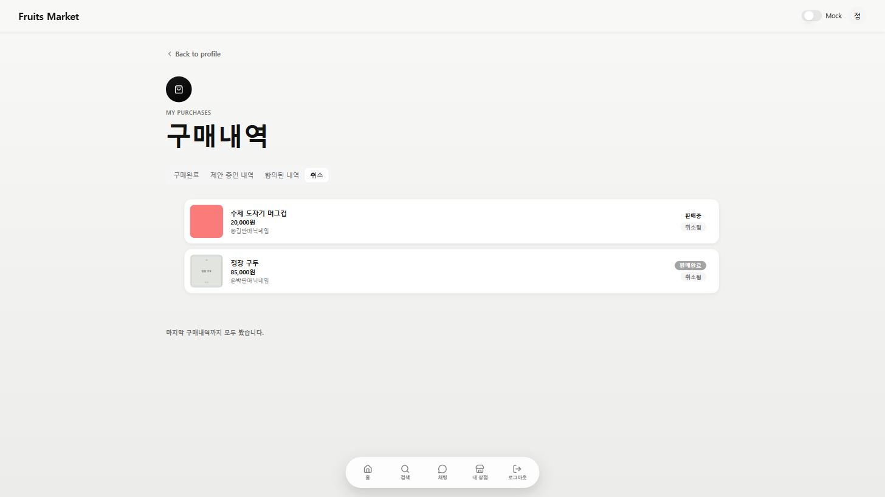 |
| | 구매내역 "합의된 내역" 탭에 `승인됨` 뱃지 + 구매하기/취소 버튼 | "취소" 탭으로 옮겨가 `취소됨` 뱃지만 노출(액션 버튼 없음) |
| **판매자 화면** | 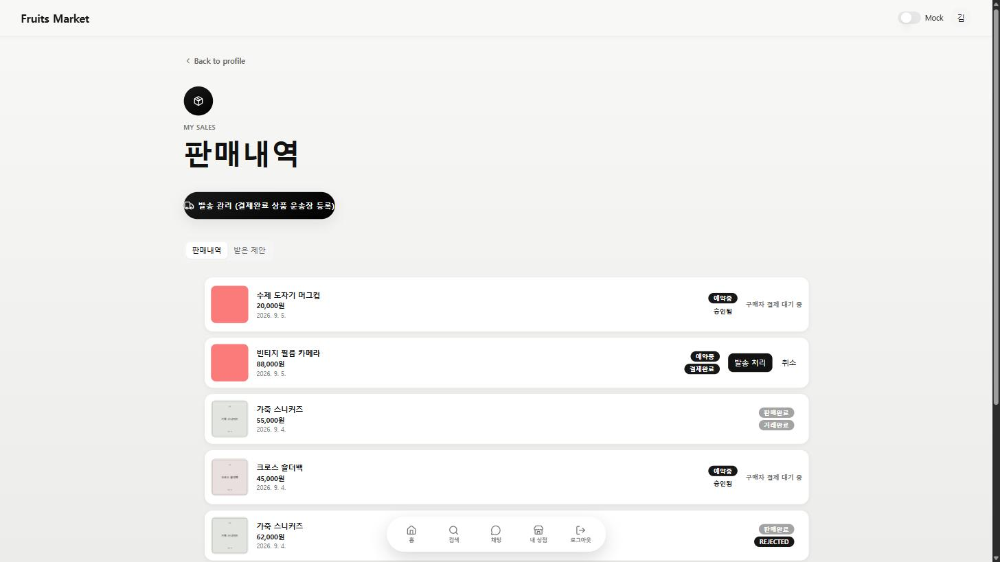 | 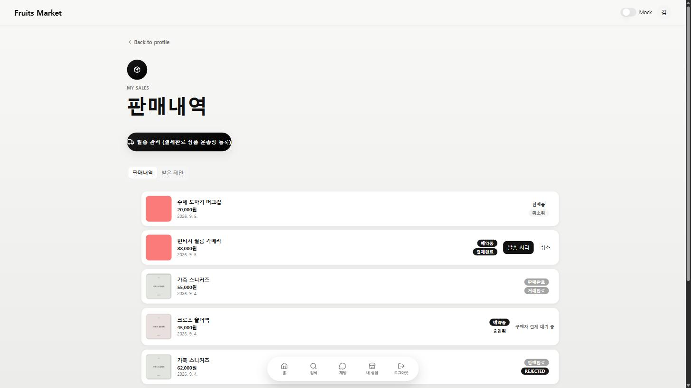 |
| | 판매내역에 `승인됨` 뱃지 + "구매자 결제 대기 중" | 같은 행이 `취소됨`으로 갱신 |

> 구매자 쪽 "취소" 탭은 원래 프론트에 없었다(`PurchaseHistory.jsx`의 탭이 제안중/합의된 내역/구매완료
> 3개뿐이라 `CANCELED` 주문이 어느 탭에도 노출되지 않는 사각지대였음) — 이 스크린샷을 위해 `TAB_STATUSES`에
> `cancelled: ["CANCELED"]`와 탭 버튼을 추가했다. 상품 상세의 구매/제안 버튼 딤드 처리도 마찬가지로
> `Detail.jsx`가 `item.status`와 무관하게 버튼을 항상 활성 상태로 두던 것을 이번에 고쳤다
> (판매내역 쪽은 상태 필터가 없어 기존 코드 그대로도 `CANCELED`가 노출됨).

---

### 2-8. 실시간 채팅 & STOMP CONNECT 프레임 인증

**문제상황**
상품 문의용 1:1 실시간 채팅이 필요한데, WebSocket 연결에도 REST와 동일한 JWT 인증을 적용해야 한다.
그런데 **브라우저 네이티브 WebSocket 핸드셰이크에는 커스텀 헤더(`Authorization`)를 실을 수 없다.**

**트레이드오프**

| 선택지 | 채택 | 이유 · 대가 |
|---|---|---|
| 핸드셰이크(HTTP Upgrade)에서 인증 vs **STOMP CONNECT 프레임에서 인증** | CONNECT 프레임 | 네이티브 WebSocket 제약을 우회. STOMP는 애플리케이션 레벨 프레임이라 `Authorization` 헤더를 실을 수 있음 |
| 텍스트/제안을 모두 STOMP publish로 vs **텍스트만 STOMP, 제안 CRUD는 REST** | 혼합 | 제안 수락은 주문 전이 등 부수효과가 커서 트랜잭션·에러 처리가 명확한 REST가 적합. 처리 결과만 `messagingTemplate`으로 브로드캐스트 |
| 낙관적 UI 없이 서버 응답 대기 vs **낙관적 렌더링** | 낙관적 | 전송 즉시 "전송 중" 버블 표시 후 브로드캐스트 수신 시 교체, 실패 시 "전송 실패" |

**기능**
`/ws-chat` 핸드셰이크 → CONNECT 프레임의 `Authorization: Bearer <jwt>` 검증 → `/app/chat/rooms/{id}/messages`
발행, `/topic/chat/rooms/{id}` 구독으로 실시간 송수신. 방 목록/이력은 REST(`/api/chat/rooms/**`).

**구현**
- `web/config/WebSocketConfig` — `addEndpoint("/ws-chat").setAllowedOriginPatterns(allowedOrigins)`, `enableSimpleBroker("/topic", "/queue")`, `setApplicationDestinationPrefixes("/app")`, `configureClientInboundChannel`에 인터셉터 등록 (`WebSocketConfig.java:29,35,42,43`)
- `web/interceptor/StompAuthChannelInterceptor` — `preSend()`에서 `StompCommand.CONNECT`일 때만 `accessor.getFirstNativeHeader("Authorization")` → `jwtTokenProvider.parseLoginMember()` → 세션 속성에 `LoginMember` 저장. 토큰 없으면 `JwtAuthenticationException` (`StompAuthChannelInterceptor.java:28,31,32,37,41`)
- `domain/chat/chatmessage/ChatMessageController` — `@MessageMapping`, 처리 후 `messagingTemplate.convertAndSend("/topic/chat/rooms/" + id, response)`, `@MessageExceptionHandler`로 STOMP 예외를 로깅
- 프론트: `frontend/src/context/ChatSocketContext.jsx` — `@stomp/stompjs` `Client`, `beforeConnect`에서 최신 Access Token을 CONNECT 헤더에 주입, `reconnectDelay: 5000`

**화면 흐름**

| 메시지 입력 | 전송(낙관적 렌더링) | 대화 + 제안 카드 |
|---|---|---|
| 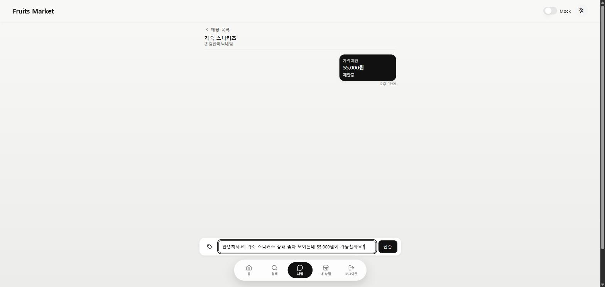 | 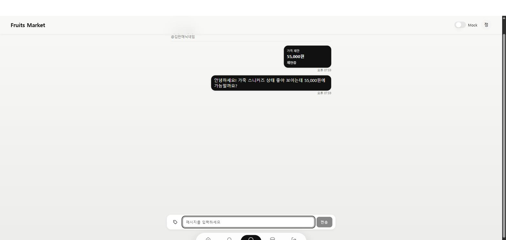 | 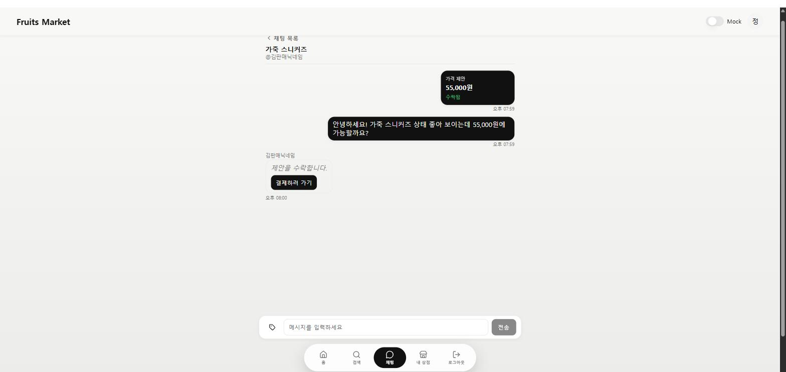 |
| 상품 상세 "문의하기"로 진입한 채팅방 | 전송 즉시 내 버블로 표시(STOMP publish → 브로드캐스트 수신) | 텍스트 메시지 · 가격 제안 카드 · 수락 시스템 메시지 · "결제하러 가기" 액션이 한 방에 |

---

### 2-9. 가격 제안(OFFER) ↔ 주문 연동 & 경쟁 제안 자동 거절

**문제상황**
채팅에서 흥정한 가격이 실제 거래로 이어지려면 제안(OFFER)과 주문(Orders)이 원자적으로 연결돼야 한다.
또 한 상품에 여러 명이 제안한 상태에서 판매자가 하나를 수락하면 **나머지 제안은 자동으로 거절**돼야 한다.

**트레이드오프**

| 선택지 | 채택 | 이유 · 대가 |
|---|---|---|
| 주문을 "수락 시" 생성 vs **"제안 시(REQUESTED)" 생성** | 제안 시 | 수락 로직을 단순화. 거절 시 orphan 주문이 남지 않도록 `rejectOffer`가 대응 주문도 `REJECTED`로 전이 |
| 원본 OFFER 메시지 상태만 변경 vs **수락/거절 시스템 메시지를 새 레코드로 추가** | 새 레코드 | 대화 흐름에 "제안을 수락합니다." 같은 맥락이 남음 |
| 경쟁 제안 거절을 애플리케이션 반복문으로 vs **단일 `UPDATE`** | 단일 UPDATE | `ChatMessageRepository.rejectOtherOffers` / `OrdersRepository.rejectOtherOrders` — 같은 상품의 다른 `PENDING` 제안·`REQUESTED` 주문을 한 번에 전이 |

**기능**
제안 생성 시 채팅방(없으면 생성) + `REQUESTED` 주문 생성. 판매자가 수락하면 상품 `RESERVED`,
주문 `REQUESTED → RESERVED` + `agreedPrice` 확정, **같은 상품의 다른 제안·주문 일괄 `REJECTED`**.
구매자 화면에는 "결제하러 가기"가 나타나고, 협의가가 결제 화면으로 이어진다.

**구현**
- `domain/chat/chatroom/ChatRoomService.createOffer()` — 상품 `SELLING` 검증 → 방 조회/생성 → `chatMessageService.sendOffer()` + `ordersService.createNegotiationOrder(...)`
- `ChatRoomService.acceptOffer()` — 방 소속·OFFER·`PENDING`·상품 `SELLING` 검증 → `ordersService.acceptNegotiation()` (여기서 `findByIdWithMemberForUpdate` 비관적 락) + `chatMessageService.acceptOffer()`
- `domain/chat/chatmessage/repository/ChatMessageRepository.rejectOtherOffers()` — `@Modifying` 네이티브: `message_type='OFFER' AND offer_status='PENDING' AND chat_message_id <> :accepted AND EXISTS(방.item_id = :itemId)`
- `domain/orders/repository/OrdersRepository.rejectOtherOrders()` — `@Modifying` 네이티브: `order_status='REQUESTED' AND item_id=:itemId AND orders_id <> :accepted`

**동작 근거(실제 DB)**
같은 상품(item 5)에 buyer1(55,000) · buyer2(62,000)가 제안 → 판매자가 buyer1 제안 수락:

```text
-- orders (item 5)
 orders_id | order_status | agreed_price | buyer_id
-----------+--------------+--------------+----------
         9 | REJECTED     |        62000 |        6   -- buyer2, 자동 거절
        10 | RESERVED     |        55000 |        5   -- buyer1, 수락

-- chat_message (item 5 의 OFFER)
 id | offer_status | offered_price | chatroom_id
----+--------------+---------------+-------------
 12 | ACCEPTED     |         55000 |           7
 11 | REJECTED     |         62000 |           6   -- 다른 방의 경쟁 제안도 함께 거절
```

**화면 흐름**

| 판매자 · 제안 수신 | 구매자 · 수락 후 | 경쟁 제안자 · 자동 거절 |
|---|---|---|
| 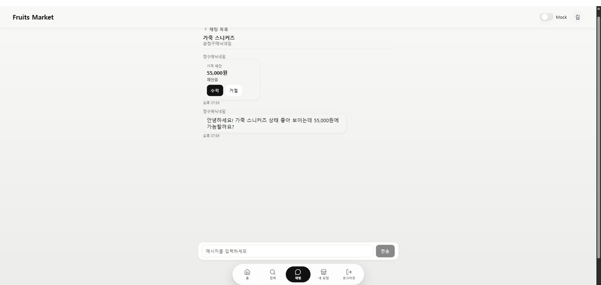 |  | 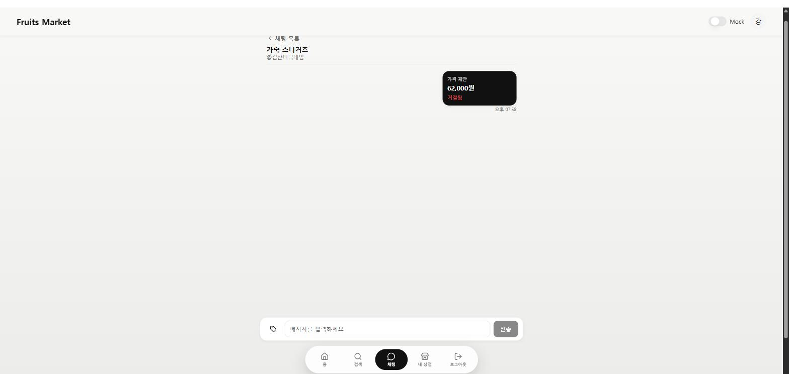 |
| 제안 카드에 `제안중` + **수락/거절** | 카드가 `수락됨`으로, 시스템 메시지 + **결제하러 가기** 버튼 등장 | 다른 방의 62,000원 제안이 판매자 액션 없이 `거절됨`으로 전환 |

추가로, 협의가는 그대로 결제 화면으로 이어진다:

| 협의가 결제 |
|---|
| 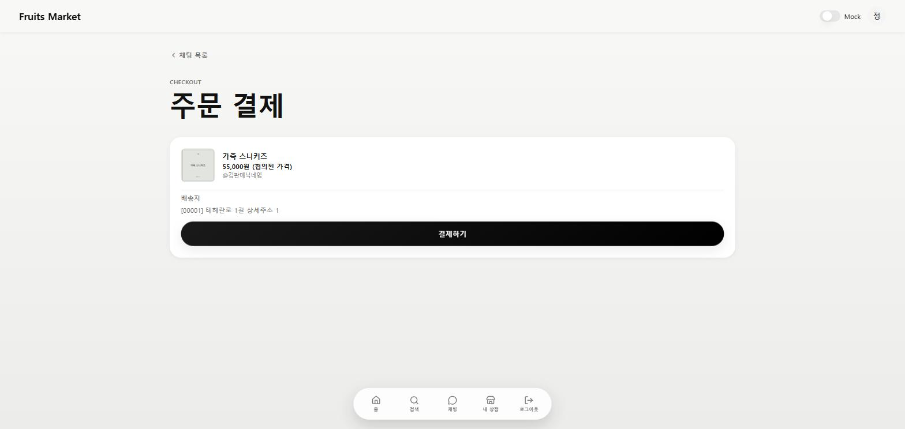 |
| "55,000원 (협의된 가격)" — `Orders.agreedPrice`가 상품 원가와 별개로 결제에 반영 |

---

### 2-10. 통일된 예외 응답 설계

**문제상황**
도메인마다 예외 클래스가 제각각이고 응답 포맷이 일관되지 않았다. 일부 예외는 HTTP 매핑이 없어
500 whitelabel 페이지로 샜다.

**트레이드오프**

| 선택지 | 채택 | 이유 · 대가 |
|---|---|---|
| 예외마다 `@ResponseStatus` vs **공통 부모 `ApplicationException` + `ErrorCode` enum** | 공통 부모 | 새 예외를 추가해도 핸들러 수정 불필요 — `ErrorCode(code, HttpStatus)`만 지정. 핸들러는 `e.getErrorCode().getStatus()`로 응답 |
| 모든 예외를 `{error, message}`로 강제 vs **Spring 프레임워크 예외는 기본 포맷 허용** | 부분 통일 | 도메인 예외만 통일. Security 인증 실패·`MissingServletRequestParameterException` 등은 Spring 기본 포맷 — 완전 통일은 후속 과제로 남김 |

**기능**
도메인 예외는 `{"error": "<code>", "message": "<사람이 읽는 메시지>"}` 형태로 상태 코드와 함께 응답.
Bean Validation 실패는 `"field: message"`를 콤마로 조인해 400으로 응답.

**구현**
- `web/exception/GlobalExceptionHandler` (`@RestControllerAdvice`)
  - `ApplicationException` → `ResponseEntity.status(errorCode.getStatus()).body(new ErrorResponse(code, message))` (`:13-18`)
  - `PessimisticLockingFailureException` → 409 (`:20-24`)
  - `MethodArgumentNotValidException` → 400 `invalid_request` (`:26-32`)
- `web/exception/ErrorCode` — `INVALID_REQUEST(400)`, `UNAUTHORIZED(401)`, `FORBIDDEN(403)`, `NOT_FOUND_*(404)`, `DUPLICATE_*(409)`, `CONFLICT_STATE(409)`
- 도메인별: `ItemException`, `OrdersException`, `ChatRoomException`, `MemberException`, `LoginFailException`, `JwtAuthenticationException` 등이 공통 부모를 상속

**동작 근거(실제 응답)**

```json
// 도메인 예외 — 통일 포맷
GET  /api/items/99999              → 404  {"error":"not_found_item","message":"상품을 찾을 수 없습니다"}
POST /api/orders/12  (예약된 상품)  → 409  {"error":"conflict_state","message":"구매할 수 없는 상품입니다"}
PATCH /api/orders/10 {"action":"PAY"} (완료된 주문)
                                   → 409  {"error":"conflict_state","message":"잘못된 순서의 상태 변경입니다."}

// Spring 프레임워크 예외 — 기본 포맷 (의도된 차이)
GET  /api/members/me  (미인증)      → 403  {"timestamp":"...","status":403,"error":"Forbidden","path":"/api/members/me"}
```

> 화면 흐름: 프론트는 실패 시 `error.message`를 상단 토스트로 노출하거나(2-8의 "전송 실패" 등),
> 결제 화면처럼 인라인 안내로 표시한다(2-6의 "이미 예약되었거나 판매 완료된 상품입니다.").

---

### 2-11. 사용자 활동 로그 — AOP + 비동기 이벤트

**문제상황**
상품 조회·찜·주문 같은 사용자 활동을 감사/분석용으로 남기고 싶은데, 각 서비스 메서드에 로깅 코드를
흩뿌리면 핵심 로직이 지저분해지고 로깅 실패가 본 트랜잭션에 영향을 준다.

**트레이드오프**

| 선택지 | 채택 | 이유 · 대가 |
|---|---|---|
| 서비스마다 로깅 호출 vs **`@LogUserActivity` 애너테이션 + AOP** | AOP | 대상 메서드에 애너테이션만. `@AfterReturning`이라 예외 시엔 안 남음 |
| 파라미터를 위치로 추출 vs **SpEL 표현식** | SpEL | `@LogUserActivity(typeExpr=..., itemIdExpr=...)`로 유연하게 대상 id 추출 |
| 동기 기록 vs **이벤트 발행 → `@Async` 저장** | 비동기 | 요청 지연 없음. 로깅 실패가 본 로직과 격리 |

**기능**
`@LogUserActivity`가 붙은 컨트롤러/서비스 메서드가 정상 반환되면, SpEL로 추출한 `memberId`/`itemId`/`activityType`을
이벤트로 발행하고 별도 스레드 풀이 `activity_log`에 저장한다.

**구현**
- `web/aop/ActivityLogAspect` — `@Aspect`, `@AfterReturning(pointcut = "@annotation(logUserActivity)")`, `SpelExpressionParser`로 표현식 평가 → `eventPublisher.publishEvent(new UserActivityEvent(...))` (`ActivityLogAspect.java:26,33,35,49`)
- `domain/activitylog/event/*` — 리스너가 `@Async`로 `ActivityLog` 저장
- `web/config/AsyncConfig` — `activityLogExecutor` (임베딩용 풀과 분리)

**동작 근거(실제 DB)**

```text
-- activity_log  (본 문서 작성 중 발생한 실제 액션들이 비동기로 적재됨)
 id |     activity_type | item_id | member_id
----+-------------------+---------+-----------
 27 | ORDER_CONFIRMED   |       5 |         5
 26 | ORDER_SHIPPED     |       5 |         1
 25 | ORDER_ACCEPTED    |       9 |         1
 24 | ORDER_PAID        |       5 |         5
 23 | ITEM_VIEW         |       5 |    (null)   -- 비로그인 조회도 기록
```

---

### 2-12. 데모 시드 데이터 설계 (InitDb)

**문제상황**
데모·개발용으로 "네고 대기 / 경쟁 수락 / 결제완료 대기 / 거래완료 / 취소" 등 **다양한 상태 조합**이 필요한데,
운영 DB는 오염되면 안 되고, 시드 데이터가 실제 비즈니스 규칙과 어긋나면 안 된다.

**트레이드오프**

| 선택지 | 채택 | 이유 · 대가 |
|---|---|---|
| 리포지토리에 엔티티 직접 insert vs **실제 서비스 계층 호출** | 서비스 호출 | `ChatRoomService`/`OrdersService`/`WishListService`를 그대로 호출 → 네고 수락 시 경쟁 제안 자동 거절, `OrdersHistory` 적재 같은 부수효과까지 실제 로직대로 재현. 대가: 시드 코드가 서비스 API에 의존 |
| 매 부팅 재시딩 vs **1회만** | 1회 | `memberRepository.count() > 0`이면 즉시 종료. `ddl-auto=update`라 데이터가 유지됨 |
| 전 프로필 vs **`@Profile({"local","dev"})`** | 제한 | 운영/테스트에선 빈으로 등록조차 안 됨 |

**기능**
기동 시 1회, 판매자 4명·구매자 6명·상품 15개와 함께 주문/채팅/위시리스트의 상태 조합을 실제 서비스
호출로 생성한다.

**구현**
- `InitDb implements ApplicationRunner`, `@Component @Profile({"local","dev"})`
- 비밀번호도 `passwordEncoder.encode("password123!")`로 실제 해싱
- 시드 상품은 `itemRepository.save`를 직접 써서 임베딩 이벤트를 발행하지 않음 → 임베딩은 10분 backfill이 채움(2-4 참고)

**화면 흐름**

| 시드 직후 홈 |
|---|
| 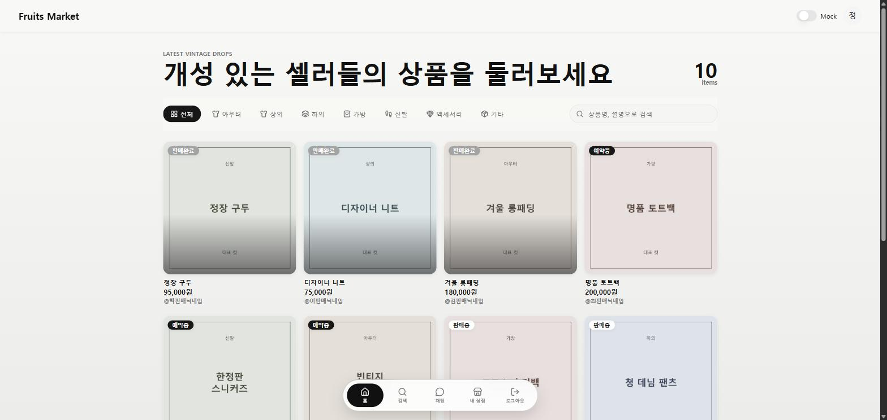 |
| `판매중`·`예약중`·`판매완료`가 섞인 목록 — 시나리오별 주문/채팅이 이미 얽혀 있는 상태로 시작 |

---

### 2-13. CI/CD & 컨테이너 배포

**문제상황**
컴파일 에러·테스트 실패가 main에 섞여 들어가는 것을 막고, 배포 산출물을 재현 가능하게 만들어야 한다.

**트레이드오프**

| 선택지 | 채택 | 이유 · 대가 |
|---|---|---|
| 단일 `build` 스텝 vs **컴파일 스텝 분리** | 분리 | `./gradlew classes testClasses`를 먼저 돌려 컴파일 실패를 테스트 실패와 구분 |
| 이미지 빌드에 테스트 포함 vs **`-x test`로 제외** | 제외 | Testcontainers는 Docker-in-Docker가 필요 → CI(ubuntu 러너)가 담당, 이미지 빌드는 `bootJar`만 |
| Fat JAR vs **`jarmode=tools` 레이어 분리** | 레이어 분리 | `lib/` → `app.jar` 순서로 복사해 의존성 레이어 캐시 활용 |
| 실패 알림을 항상 vs **secret 있을 때만** | 조건부 | `if: failure() && env.DISCORD_WEBHOOK != ''` — webhook 미설정 시 조용히 skip |

**기능**
- `push`/`PR`(main) → `ci.yml`: 컴파일 → 빌드 + 전체 테스트(Testcontainers) → 테스트 리포트 아티팩트 → 실패 시 Discord 알림
- `v*` 태그 → `release.yml`: 멀티 스테이지 Docker 빌드 → GHCR(`ghcr.io/<owner>/used-market`) push
- 운영: `docker-compose.prod.yml`로 단일 서버에 `app`(GHCR 이미지) + `postgres`(pgvector, 포트 미노출, healthcheck)

**구현**
- `.github/workflows/ci.yml` — Temurin 17, `gradle/actions/wrapper-validation`(래퍼 변조 방지), `./gradlew classes testClasses` → `./gradlew build`, `actions/upload-artifact`, `sarisia/actions-status-discord`
- `Dockerfile` — 빌드 스테이지 `eclipse-temurin:17-jdk-jammy`에서 `./gradlew clean bootJar -x test` → `jarmode=tools`로 레이어 추출, 런타임 `17-jre-jammy`, 비루트 `spring` 유저, `HEALTHCHECK`는 `GET /api/items?page=0&size=1`
- 임베딩 테스트 3종은 `@EnabledIfEnvironmentVariable(GEMINI_API_KEY)`로 CI에서 자동 skip

**화면 흐름**

| 워크플로 실행 목록 | 실행 요약 | Job 스텝 |
|---|---|---|
| 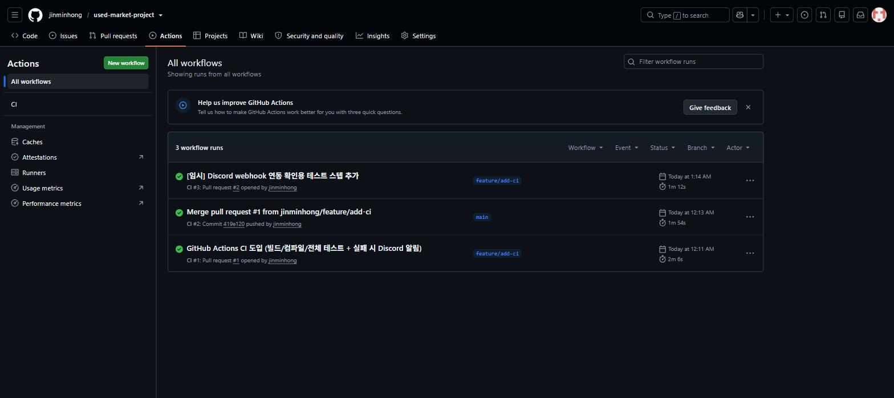 | 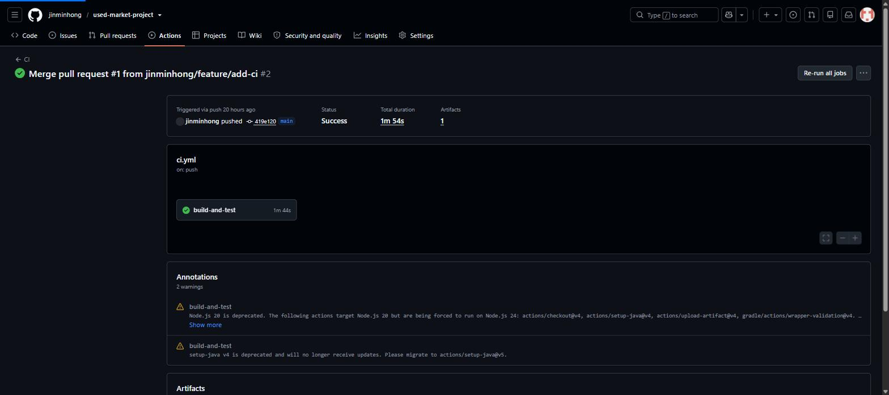 | 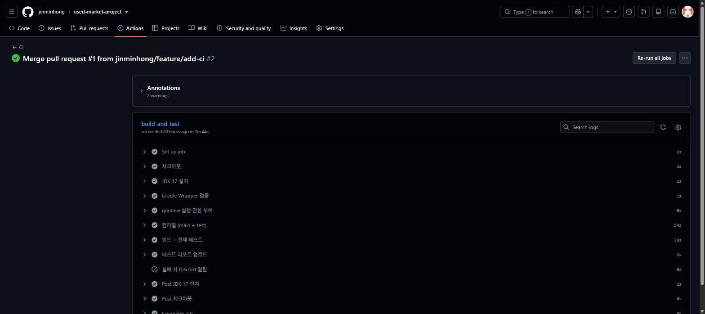 |
| main·feature 브랜치의 CI 실행이 모두 통과 | push 트리거, `build-and-test` 1분 44초, 아티팩트 1개 | 체크아웃 → JDK 17 → Wrapper 검증 → **컴파일(54s)** → **빌드+전체 테스트(39s)** → 리포트 업로드 → (성공 시 Discord 알림 skip) |

---

### 2-14. 프론트엔드 — Access Token 메모리 보관 & 자동 재발급

**문제상황**
Access Token을 `localStorage`에 두면 XSS 한 방에 탈취된다. 그렇다고 매 요청마다 재발급하면 느리다.

**트레이드오프**

| 선택지 | 채택 | 이유 · 대가 |
|---|---|---|
| `localStorage` vs **모듈 메모리 싱글턴** | 메모리 | XSS로 인한 토큰 탈취 위험을 낮춤. 대가: 새로고침하면 메모리가 날아감 → 마운트 시 silent refresh로 복원 |
| 401을 그대로 노출 vs **투명한 재발급 + 1회 재시도** | 재시도 | `client.js`가 401 감지 → `/api/token/refresh` → 원 요청 1회 재시도. 무한 루프 방지를 위해 재시도는 1회로 제한 |

**기능**
Access Token은 `localStorage`가 아닌 모듈 메모리에만 산다. Refresh Token은 `HttpOnly` 쿠키라 JS가
접근할 수 없다. 401이 나면 사용자가 눈치채기 전에 재발급하고 원 요청을 다시 보낸다.

**구현**
- `frontend/src/api/tokenStore.js` — 모듈 스코프 변수 하나에 토큰 보관, `SessionContext.jsx`와 `ChatSocketContext.jsx`가 공유
- `frontend/src/api/client.js` — 매 요청에 `Authorization: Bearer` 부착, 401 시 `tryRefresh()` 후 재시도
- `frontend/src/context/SessionContext.jsx` — 마운트 시 `POST /api/token/refresh` → 성공하면 `GET /api/members/me`로 세션 복원

**동작 근거(실제 관측)**
로그인 상태에서 브라우저 저장소를 조회하면 토큰이 없다.

```json
{ "localStorage": {}, "sessionStorage": {} }   // Access Token 은 메모리에만 존재
```

---

### 2-15. 프론트엔드 — 상품 탐색 UX (무한 스크롤 + URL 동기화 + 디바운스)

**문제상황**
카테고리·검색어를 컴포넌트 state로만 들고 있으면 뒤로가기/공유가 깨지고, 입력마다 서버를 때리면
과하다. 페이지네이션 버튼은 모바일에서 번거롭다.

**트레이드오프**

| 선택지 | 채택 | 이유 · 대가 |
|---|---|---|
| state 관리 vs **`useSearchParams`(URL 쿼리)** | URL | 뒤로가기·새로고침·링크 공유에 필터가 보존됨 |
| 입력마다 조회 vs **300ms 디바운스** | 디바운스 | 타이핑 중 불필요한 요청 억제. 조건 변경 시 `page`를 0으로 리셋 |
| 페이지네이션 버튼 vs **스크롤 기반 무한 로드** | 무한 로드 | 모바일 우선 UX. `Slice` + `hasNext`로 다음 페이지 존재 여부만 받아 처리(총 count 쿼리 없음) |

**기능**
카테고리 탭·검색어는 URL 쿼리(`?category=`, `?q=`)로 관리되고, 변경 시 300ms 뒤 0페이지부터 재조회한다.
목록 하단 근처로 스크롤하면 다음 페이지를 이어 붙인다.

**구현**
- `frontend/src/pages/Home.jsx` — `useSearchParams`, 300ms 디바운스, `window` scroll 리스너(하단 500px 이내 진입 시 다음 페이지), 중복 요청 가드(`inFlightItemRequestRef`, `loadedItemPagesRef`)
- `frontend/src/api/client.js` `listItems(page, size, condition)` — `keyword`/`category`/`status`/`priceGoe`/`priceLoe`를 쿼리 파라미터로 조립
- 백엔드 `Slice<ItemListDto>` + `limit(size+1)` → `hasNext`

**화면 흐름**

| 전체 목록 | 카테고리 "가방" | 무한 스크롤 끝 |
|---|---|---|
|  | 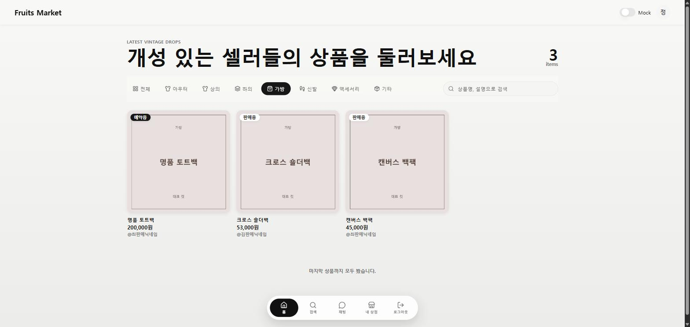 | 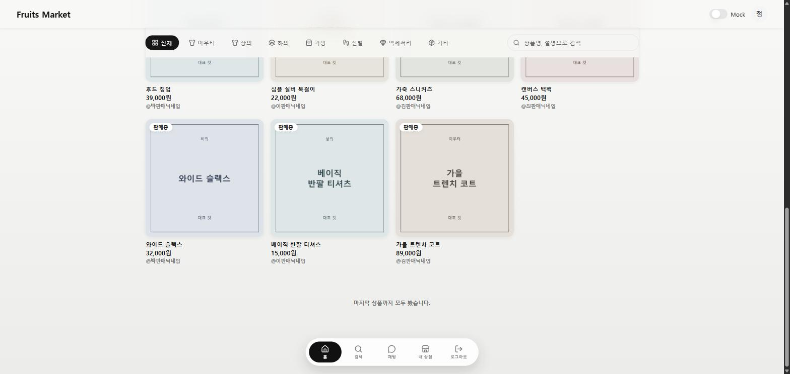 |
| 카테고리 탭 + 검색 입력 | 탭 클릭 → URL `?category=BAG`, 3개로 필터 | 스크롤로 2페이지를 이어 붙이고 "마지막 상품까지 모두 봤습니다." |

---

## 3. 테스트

- 도메인별 `@SpringBootTest` + Testcontainers(`pgvector/pgvector:pg16`, `@ServiceConnection`) — `test` 프로필 고정
- 동시성 테스트: `OrdersServiceConcurrencyTest`, `ChatRoomServiceConcurrencyTest`
- 임베딩 테스트 3종은 `GEMINI_API_KEY`가 있을 때만 실행(`@EnabledIfEnvironmentVariable`) → CI에서 자동 skip
- 프론트엔드 자동화 테스트 스위트는 없음 — 변경은 실행 중인 앱으로 수동 검증 병행
