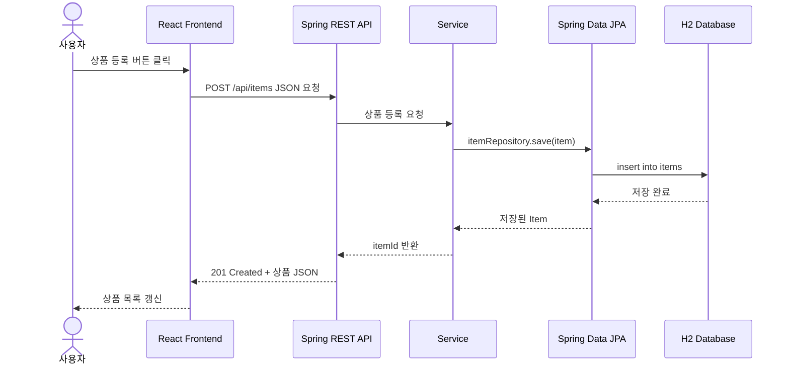

# 중고거래 REST API + React 설계 방향

백엔드는 직접 설계한다고 했으니, 이 문서는 프론트가 어떤 API를 기대하고 어떻게 화면에 뿌리는지에 초점을 둡니다.

## 전체 구조



## 추천 주소

- Spring API: `http://localhost:8080/api`
- React 개발 화면: `http://localhost:5173`
- Spring CORS 허용 Origin: `http://localhost:5173`

현재 `frontend/vite.config.js`에는 개발용 프록시가 들어 있습니다.

```text
React http://localhost:5173/api/items
-> Vite proxy
-> Spring http://localhost:8080/api/items
```

이 방식이면 개발 중에는 CORS 설정 없이도 React에서 Spring API를 호출할 수 있습니다.

## IntelliJ에서 실행하는 방법

IntelliJ 터미널을 2개 엽니다.

첫 번째 터미널에서는 Spring Boot를 실행합니다.

```powershell
cd C:\JavaStudy\springStudy\project
.\gradlew.bat bootRun
```

두 번째 터미널에서는 React를 실행합니다.

```powershell
cd C:\JavaStudy\springStudy\project\frontend
npm install
npm run dev
```

브라우저 접속 주소:

```text
http://localhost:5173
```

`Mock API` 체크가 켜져 있으면 백엔드 없이 가짜 데이터로 동작합니다. 체크를 끄면 Spring의 `/api/items`를 호출합니다.

## 상품 API 설계

| 기능 | Method | URL |
| --- | --- | --- |
| 상품 목록 | GET | `/api/items` |
| 상품 상세 | GET | `/api/items/{itemId}` |
| 상품 등록 | POST | `/api/items` |
| 상품 수정 | PATCH | `/api/items/{itemId}` |
| 상품 삭제 | DELETE | `/api/items/{itemId}` |

### 상품 목록 응답

```json
{
  "items": [
    {
      "id": 1,
      "title": "맥북 프로",
      "description": "상태 좋습니다.",
      "price": 1200000,
      "status": "SELLING",
      "sellerId": 1
    }
  ],
  "total": 1
}
```

### 상품 등록 요청

```http
POST /api/items
Content-Type: application/json
```

```json
{
  "title": "맥북 프로",
  "description": "상태 좋습니다.",
  "price": 1200000,
  "sellerId": 1
}
```

### 상품 수정 요청

```http
PATCH /api/items/1
Content-Type: application/json
```

```json
{
  "title": "맥북 프로 가격 인하",
  "description": "빠른 거래 원합니다.",
  "price": 1100000,
  "status": "RESERVED"
}
```

## 회원 API 설계

| 기능 | Method | URL |
| --- | --- | --- |
| 회원 가입 | POST | `/api/members` |
| 로그인 | POST | `/api/login` |

회원 가입 요청:

```json
{
  "loginId": "user1",
  "name": "홍길동",
  "password": "1234"
}
```

## 프론트에서 API를 보내고 화면에 뿌리는 방식

React에서는 보통 다음 흐름입니다.

1. 사용자가 input에 값을 입력합니다.
2. `useState`가 입력값을 기억합니다.
3. 버튼을 누르면 `fetch()`로 REST API에 JSON을 보냅니다.
4. 백엔드가 JSON을 응답합니다.
5. 응답 JSON을 다시 `useState`에 넣습니다.
6. state가 바뀌면 React가 화면을 다시 그립니다.

핵심 예시:

```javascript
const response = await fetch("http://localhost:8080/api/items", {
  method: "POST",
  headers: {
    "Content-Type": "application/json",
  },
  body: JSON.stringify({
    title,
    description,
    price,
    sellerId,
  }),
});

const createdItem = await response.json();
setItems((items) => [createdItem, ...items]);
```

## MyBatis에서 JPA로 바꾸는 방향

기존 방식:

```java
@Mapper
public interface ItemRepository {
    void save(Item item);
}
```

JPA 방식:

```java
public interface ItemRepository extends JpaRepository<Item, Long> {
}
```

기본 CRUD는 직접 SQL을 안 써도 됩니다.

- 저장: `itemRepository.save(item)`
- 단건 조회: `itemRepository.findById(id)`
- 전체 조회: `itemRepository.findAll()`
- 삭제: `itemRepository.deleteById(id)`

복잡한 조건 조회가 필요하면 메서드 이름으로 시작하면 됩니다.

```java
List<Item> findByStatus(ItemStatus status);
List<Item> findBySellerId(Long sellerId);
```

## 다형성 고려

처음부터 상품 타입을 과하게 나누기보다는 단일 `Item`으로 시작하고, 실제로 상품 타입별 필드가 생겼을 때 JPA 상속을 적용하는 편이 좋습니다.

```java
@Entity
@Inheritance(strategy = InheritanceType.JOINED)
public abstract class Item {
}
```

예:

```java
@Entity
public class DigitalItem extends Item {
    private String serialNumber;
}
```
